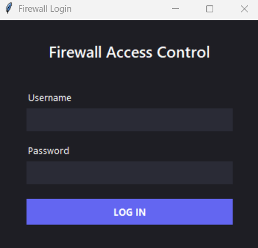
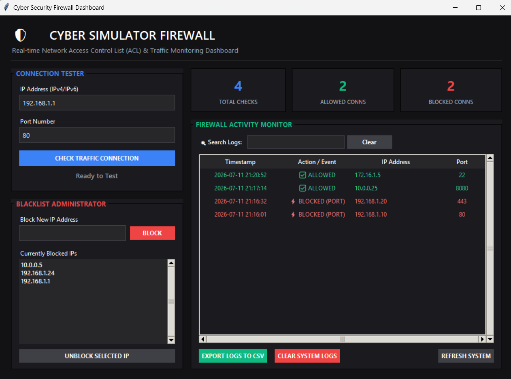
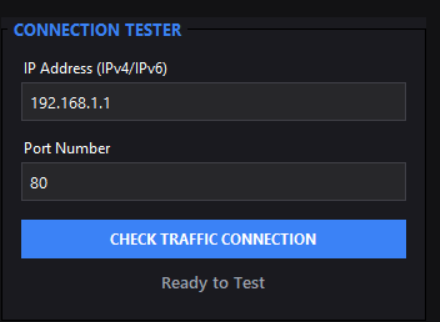
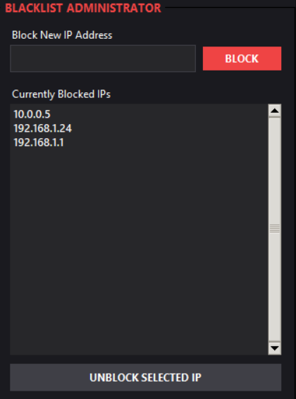
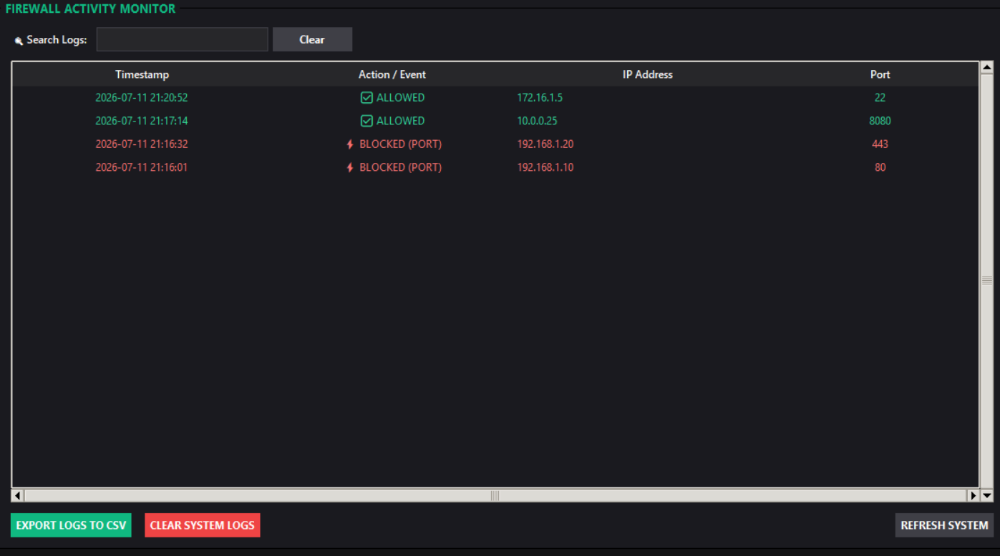

<div align="center">

# 🛡️ Python Firewall Simulator

### 🚀 A GUI-Based Cybersecurity Firewall Simulator Built with Python

<p>
A professional desktop-based Firewall Simulator developed using <strong>Python</strong> and <strong>Tkinter</strong>. This project demonstrates core firewall concepts including IP filtering, port filtering, blacklist management, activity logging, statistics monitoring, and CSV report generation through a modern graphical user interface.
</p>

<p>


</p>

</div>

---

# 📖 About The Project

The **Python Firewall Simulator** is a desktop-based cybersecurity application designed to simulate the basic functionality of a firewall.

It enables users to:

- 🌐 Monitor simulated network access
- 🚫 Block IP addresses
- 🚪 Block specific ports
- 📋 Manage blacklisted IP addresses
- 📝 Record firewall activity logs
- 🔍 Search security logs
- 📊 Monitor firewall statistics
- 📁 Export logs to CSV reports

The project provides a practical understanding of firewall concepts and security monitoring through an interactive graphical interface.

---

# ✨ Features

- 🔐 Secure Admin Login
- 🌐 IP Address Filtering
- 🚪 Port Filtering
- 🚫 Add IP to Blacklist
- 🗑 Remove IP from Blacklist
- 📋 Display Blacklisted IP Addresses
- 📝 Firewall Activity Logging
- 🔍 Search Logs by IP Address
- 📊 Firewall Statistics Dashboard
- 📁 Export Logs to CSV
- 💾 Persistent Blacklist Storage
- 🖥 Interactive Tkinter GUI
- ⚡ Clean & User-Friendly Interface

---

# 🛠️ Tech Stack

| Category | Technologies |
|----------|--------------|
| Language | Python 3 |
| GUI | Tkinter |
| File Handling | Text Files |
| Logging | Datetime Module |
| Report Generation | CSV |
| Version Control | Git & GitHub |

---

# 📂 Project Structure

```text
python-firewall-simulator/
│
├── login_firewall.py
├── firewall_gui.py
├── firewall.py
├── config.py
├── utils.py
├── blacklist.txt
├── firewall_log.txt
├── firewall_report.csv
├── screenshots/
│   ├── login.png
│   ├── dashboard.png
│   ├── logs.png
│   ├── blacklist.png
│   ├── statistics.png
│   └── search_logs.png
│
├── .gitignore
└── README.md
```

---

# 📸 Project Preview

## 🔐 Login Screen



---

## 🖥️ Firewall Dashboard



---

## 📝 Firewall Logs



---

## 🚫 Blacklisted IPs



---

## 📊 Firewall Statistics


---

## 🔍 Search Logs



---

# 🚀 Installation

## Clone Repository

```bash
git clone https://github.com/saiballari/python-firewall-simulator.git
```

---

## Navigate to Project

```bash
cd python-firewall-simulator
```

---

## Run Application

```bash
python login_firewall.py
```

---

# 🔑 Default Login Credentials

| Username | Password |
|----------|----------|
| admin | admin123 |

> You can modify these credentials directly in the source code if required.

---

# 🎯 Key Highlights

✅ GUI-Based Firewall Simulator

✅ Admin Authentication

✅ IP & Port Filtering

✅ Blacklist Management

✅ Security Event Logging

✅ Search Logs Functionality

✅ Firewall Statistics Dashboard

✅ CSV Report Export

✅ Persistent Data Storage

---

# 📚 Learning Outcomes

This project helped me gain practical experience in:

- Firewall Fundamentals
- Cybersecurity Concepts
- Python Programming
- Tkinter GUI Development
- File Handling
- Logging Systems
- CSV Report Generation
- Software Design
- Git & GitHub Workflow

---

# 🚀 Future Enhancements

- 🌐 Real-Time Network Traffic Monitoring
- 🗄 Database Integration
- 👥 Multiple User Authentication
- 📧 Email Alerts
- 📊 Interactive Graph Dashboard
- ⚙ Advanced Firewall Rule Management
- 📡 Packet Inspection Simulation

---

# 👨‍💻 Developer

## **Sai Ballari**

**Full Stack Developer | Cybersecurity Enthusiast | Java Programmer**

---

# 🔗 Connect With Me

### 💻 GitHub

https://github.com/saiballari

### 💼 LinkedIn
https://www.linkedin.com/in/venkata-sai-ballari-6a9737398

### 📧 Email

ballarisai10@gmail.com

---

# 🙏 Acknowledgements

This project was developed for educational purposes to demonstrate the fundamentals of firewall systems, network security, GUI application development, and Python programming.

It reflects my interest in cybersecurity and practical software development.

---

# ⭐ Support

If you found this project useful,

⭐ Star this repository

🍴 Fork this repository

📢 Share it with others

---

<div align="center">

## ⭐ Thank You for Visiting!

If you like this project, don't forget to leave a ⭐ on GitHub.

Made with ❤️ by **Sai Ballari**

</div>
